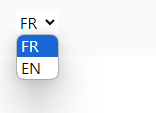

### React TypeScript Component Documentation

#### Component Name: LanguageSwitcherComponent

The `LanguageSwitcherComponent` is a language switcher component built using React and TypeScript. It provides functionality to switch between language options (`fr` and `en`) and supports different themes.

#### Props

- **theme** (`"theme-1" | "theme-2"`, optional): Specifies the theme style for the language switcher component.
- **className** (`string`, optional): Additional CSS class names to apply to the component container.

#### Usage

```tsx
import React from "react";
import { LanguageSwitcherComponentProps, LanguageSwitcher } from "./LanguageSwitcher";

// Example usage of LanguageSwitcherComponent
const MyComponent: React.FC = () => {
    return (
        <div>
            <LanguageSwitcher theme="theme-1" className="custom-language-switcher" />
            <LanguageSwitcher theme="theme-2" className="custom-language-switcher" />
        </div>
    );
};

export default MyComponent;
```

#### visual rendering

