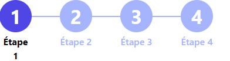

### React TypeScript Component Documentation

#### Component Name: Stepper

The `Stepper` component is a UI component used to display a step-by-step progress indicator with customizable step titles.

#### Props

- **stepList** (`string[]`, required): An array of step titles to be displayed in the stepper.
- **currentStep** (`number`, required): The index of the current active step (zero-based).
- **size** (`number`, optional): The overall width of the stepper component.

#### Usage

```tsx
import React from 'react';
import { StepperProps, Stepper } from './Stepper';

// Example usage of Stepper
const MyComponent: React.FC = () => {
    const steps = ['Step 1', 'Step 2', 'Step 3', 'Step 4'];
    const currentStep = 2; // Assuming current step is Step 3

    return (
        <div>
            <Stepper stepList={steps} currentStep={currentStep} size={300} />
        </div>
    );
};

export default MyComponent;
```


#### visual rendering

