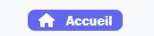

### React TypeScript Component Documentation

#### Component Name: DefaultButton

The `DefaultButton` component is a reusable button component built using React and TypeScript. It renders a button with optional text and an optional FontAwesome icon.

#### Props

- **text** (`string`, required): The text to be displayed on the button.
- **icon** (`IconDefinition`, optional): The FontAwesome icon to be displayed alongside the text.
- **onClick** (`() => void`, optional): A callback function to be executed when the button is clicked.

#### Usage

```tsx
import React from "react";
import { IconDefinition } from "@fortawesome/fontawesome-svg-core";
import { FontAwesomeIcon } from "@fortawesome/react-fontawesome";
import { DefaultButtonProps, DefaultButton } from "./DefaultButton";

// Example usage of DefaultButton
const MyComponent: React.FC = () => {
    const handleClick = () => {
        console.log("Button clicked!");
    };

    return (
        <div>
            <DefaultButton text="Click Me" onClick={handleClick} />
            <DefaultButton text="Save" icon={someFontAwesomeIcon} onClick={handleClick} />
        </div>
    );
};

export default MyComponent;
```
#### visual rendering


