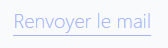

### React TypeScript Component Documentation

#### Component Name: LinkButton

The `LinkButton` component is a button component styled to resemble a hyperlink, built using React and TypeScript. It allows customization of text size and the option to display an underline effect.

#### Props

- **text** (`string`, required): The text to be displayed on the button.
- **onClick** (`() => void`, optional): A callback function to be executed when the button is clicked.
- **textSize** (`number`, optional): Font size of the button text in pixels.
- **underline** (`boolean`, optional): Whether to display an underline effect on the button text.

#### Usage

```tsx
import React from "react";
import { LinkButtonProps, LinkButton } from "./LinkButton";

// Example usage of LinkButton
const MyComponent: React.FC = () => {
    const handleClick = () => {
        console.log("LinkButton clicked!");
    };

    return (
        <div>
            <LinkButton
                text="Click Me"
                onClick={handleClick}
                textSize={16}
                underline={true}
            />
            <LinkButton
                text="Learn More"
                onClick={handleClick}
                textSize={18}
                underline={false}
            />
        </div>
    );
};

export default MyComponent;
```

#### visual rendering

