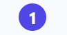

### React TypeScript Component Documentation

#### Component Name: PuceButton

The `PuceButton` component is a button component built using React and TypeScript, designed with a circular shape and customizable text and background color.

#### Props

- **text** (`string`, required): The text to be displayed on the button.
- **onClick** (`() => void`, optional): A callback function to be executed when the button is clicked.
- **bgPrimary** (`50 | 100 | 200 | 300`, optional): Background primary color intensity of the button (e.g., `50` for light, `100` for medium, `200` for dark).
- **width** (`number`, optional): Width of the button in pixels.
- **className** (`string`, optional): css custum classes.

#### Usage

```tsx
import React from "react";
import { PuceButtonProps, PuceButton } from "./PuceButton";

// Example usage of PuceButton
const MyComponent: React.FC = () => {
    const handleClick = () => {
        console.log("PuceButton clicked!");
    };

    return (
        <div>
            <PuceButton
                text="Click Me"
                onClick={handleClick}
                bgPrimary={100}
                width={100}
            />
            <PuceButton
                text="Press"
                onClick={handleClick}
                bgPrimary={200}
                width={120}
            />
        </div>
    );
};

export default MyComponent;
```

#### visual rendering

